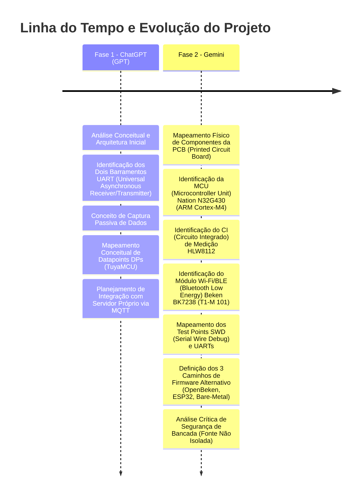
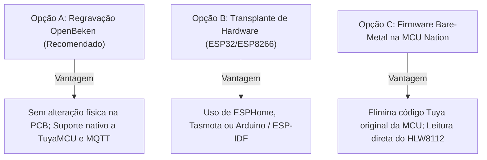

# Engenharia Reversa e Documentação Técnica: Medidor de Energia Tuya (PJ-1103C)

Repositório dedicado ao estudo, análise de hardware, engenharia reversa e desvinculação de nuvem (*cloud unbinding*) do medidor de energia bidirecional/duplo canal **Tuya PJ-1103C** (com sensores TC - Transformador de Corrente / Clamps de medição nos canais A e B).

---

## 📜 Histórico de Concepção e Contribuições das IAs (Inteligências Artificiais)

Este documento consolida as análises e discussões técnicas desenvolvidas com auxílio de IA (Inteligência Artificial), organizadas em duas etapas evolutivas:



---

## ⚠️ AVISO CRÍTICO DE SEGURANÇA ELÉTRICA

> [!CAUTION]
> **PERIGO EXTREMO: RISCO DE CHOQUE ELÉTRICO FATAL E DESTRUIÇÃO DE EQUIPAMENTOS**
>
> 1. **Fonte Não Isolada Galvanicamente:** A fonte interna deste equipamento utiliza topologia chaveada/buck *não isolada* da rede AC (Alternating Current - Corrente Alternada). Isso significa que o **GND (Ground - Terra / Referência Elétrica) da placa pode estar diretamente referenciado ao potencial de Fase ou Neutro (110V/220V)**.
> 2. **JAMAIS conecte** computadores, conversores USB-Serial (Universal Serial Bus - UART), gravadores SWD (Serial Wire Debug - como ST-Link/J-Link) ou osciloscópios aterrados aos pinos de depuração enquanto os bornes `L` e `N` estiverem plugados à tomada AC.
> 3. **Protocolo de Bancada Obrigatório:** Durante todo o processo de análise, captura serial, teste ou regravação de firmware, a placa deve estar **completamente desconectada da rede AC**, sendo alimentada unicamente por uma **fonte de bancada externa regulada em 3.3V DC (Direct Current - Corrente Contínua)**.

---

## 1. Visão Geral do Dispositivo (PJ-1103C)

* **Modelo Comercial:** PJ-1103C (versão para medição com 2 TCs - Transformadores de Corrente / Clamps A e B).
* **Tensão de Operação:** AC (Alternating Current - Corrente Alternada) 100–240V, 50/60 Hz.
* **Faixa de Corrente Suportada:** 0.2A a 80A (por canal).
* **Conectividade:** Wi-Fi 802.11 b/g/n + BLE (Bluetooth Low Energy - Bluetooth de Baixa Energia v5.2).
* **Conexões de Borne:**
  * `L` e `N`: Alimentação AC da rede elétrica (Fase e Neutro).
  * `S1` e `S2` (Canal A): Entrada do TC (Transformador de Corrente / Clamp 1).
  * `S1` e `S2` (Canal B): Entrada do TC (Transformador de Corrente / Clamp 2).

---

## 2. Arquitetura do Sistema e Topologia de Comunicação

O equipamento é estruturado em uma arquitetura modular de duplo controlador:

```mermaid
flowchart TD
    subgraph Entrada["Sensores e Rede AC (Corrente Alternada)"]
        AC["Rede Elétrica AC (L / N)"]
        ClampA["TC Clamp A (S1 / S2)"]
        ClampB["TC Clamp B (S1 / S2)"]
    end

    subgraph Medicao["Módulo de Aquisição Analógica"]
        HLW8112["CI (Circuito Integrado) de Medição\nHLW8112 (SPI / UART)"]
    end

    subgraph Controle["Processamento Principal"]
        MCU["MCU (Unidade Microcontroladora ARM Cortex-M4F)\nNation N32G430C8L7"]
        SWD["Test Points SWD (+, D, C, G)"]
        UART_FCT["UART FCT (Testes Funcionais de Fábrica)"]
    end

    subgraph Conectividade["Módulo de Rádio"]
        T1M["Módulo Vertical T1-M 101\nSoC (System on Chip) Beken BK7238 (Wi-Fi + BLE)"]
    end

    subgraph Destino["Ecossistema de Destino"]
        TuyaCloud["Nuvem Tuya (Original)"]
        LocalBroker["Broker MQTT / Home Assistant (Custom)"]
    end

    AC --> HLW8112
    ClampA --> HLW8112
    ClampB --> HLW8112

    HLW8112 <-->|Amostragem SPI / UART| MCU
    MCU <-->|Pads de Teste| SWD
    MCU <-->|Diagnóstico| UART_FCT

    MCU <-->|UART Primária (Protocolo TuyaMCU)| T1M
    T1M -.->|Firmware Stock| TuyaCloud
    T1M -.->|OpenBeken / Custom| LocalBroker
```

---

## 3. Levantamento Completo de Componentes de Hardware

*(Identificação física obtida via engenharia reversa de hardware — Origem: Gemini)*

### 3.1. Processamento e Medição

| Componente | Part Number | Características Técnicas | Função no Sistema |
| :--- | :--- | :--- | :--- |
| **MCU (Microcontroller Unit - Unidade Microcontroladora)** | `Nation N32G430C8L7` | ARM Cortex-M4F 32-bit @ 64 MHz, 64 KB Flash, 16 KB SRAM (Static Random Access Memory) | Executa a lógica local, controla periféricos, lê o CI (Circuito Integrado) de medição e comunica via protocolo TuyaMCU com o rádio. |
| **CI (Circuito Integrado) de Medição de Energia** | `HLW8112` | Front-end de alta precisão A/D (Analógico/Digital) para medição de grandezas elétricas | Amostra Tensão RMS (Root Mean Square - Valor Eficaz), Corrente RMS nos canais A e B, Potência Ativa, Potência Reativa e Fator de Potência. |

### 3.2. Módulo de Rádio e Conectividade

* **Módulo:** `T1-M 101` (placa vertical soldada em conector SMD - Surface-Mount Device).
* **SoC (System on Chip - Sistema em Chip) Integrado:** `Beken BK7238` (Wi-Fi 802.11 b/g/n + BLE - Bluetooth Low Energy 5.2 sob blindagem metálica).
* **Pinagem Serigrafada no Módulo T1-M:**
  * `3V3`: Alimentação positiva (+3.3V DC - Direct Current).
  * `GND` (*Ground*): Referência de terra elétrica.
  * `RX1` / `TX1` (ou `XTX1`): Barramento UART (Universal Asynchronous Receiver/Transmitter) primário (comunicação TuyaMCU com a MCU Nation).
  * `TX2`: Barramento UART secundário / console de depuração do SoC Beken.
  * `P24`: GPIO (General Purpose Input/Output - Entrada/Saída de Uso Geral) / pino de controle de modo de boot.

### 3.3. Alimentação, Filtragem e Proteção

* **Varistor MOV (Metal Oxide Varistor - Varistor de Óxido Metálico):** `JK-ET 7S471K` (470V, 7 mm) para supressão de surtos e transientes de rede.
* **Indutor de Potência:** Bobina `681` (680 µH) do conversor DC-DC (Direct Current to Direct Current) interno.
* **Capacitor Primário de Alta Tensão:** Eletrolítico 400V 4.7 µF para retificação primária da rede AC.
* **Capacitores de Filtragem DC:** Dois capacitores eletrolíticos SMD (Surface-Mount Device) de 10V 220 µF.
* **Alarme Sonoro:** Buzzer piezoelétrico para alertas sonoros locais de sobrecorrente e emparelhamento.

---

## 4. Interfaces de Depuração e Programação Expostas na PCB (Printed Circuit Board)

A placa possui pontos de teste (*test points*) expostos no verso da PCB:

### 4.1. Barramento SWD (Serial Wire Debug - Gravação da MCU ARM Cortex-M4)
Pads identificados no verso da placa:
* `+` : VCC (Voltage Common Collector - Tensão Positiva de Alimentação 3.3V)
* `D` : SWDIO (Serial Wire Data Input/Output)
* `C` : SWCLK (Serial Wire Clock)
* `G` : GND (Ground - Terra / Referência Elétrica)

### 4.2. Barramento UART da Placa Principal
Pads `TX`, `RX` e `GND` para monitoramento de telemetria ou diagnóstico de fábrica FCT (Functional Circuit Test - Teste Funcional de Circuito).

---

## 5. Fundamentos da Comunicação Serial e Especificação do Protocolo TuyaMCU

*(Conceitos, engenharia reversa e especificação detalhada de frames)*

### 5.1. Abertura e Modelo de Comunicação
* **Protocolo Aberto e Não Criptografado na UART:** Os dados entre a MCU Nation e o rádio Beken trafegam em **hexadecimal puro**, sem chaves criptográficas na camada serial.
* **Nível Lógico:** 3.3V TTL (Transistor-Transistor Logic) / CMOS (Complementary Metal-Oxide-Semiconductor), comunicação serial assíncrona standard `8N1` (8 bits de dados, sem paridade, 1 stop bit), usualmente operando em 9600 ou 115200 bps (bits por segundo).
* **Atenção com RS-232 (Recommended Standard 232):** Portas seriais RS-232 clássicas operam com tensões de ±12V e **destroem** os circuitos microcontrolados se conectadas diretamente sem conversor de nível (ex.: transceptor MAX3232).

### 5.2. Estrutura Completa de Frames (Pacote de Bytes)

O protocolo TuyaMCU opera por requisição/resposta e envio assíncrono de eventos através de pacotes com a seguinte anatomia:

| Campo | Tamanho | Descrição | Exemplo em Hex |
| :--- | :--- | :--- | :--- |
| **Header** | 2 bytes | Identificador fixo de sincronismo | `0x55 0xAA` |
| **Versão** | 1 byte | Versão do protocolo | `0x00` ou `0x03` |
| **Comando** | 1 byte | Código de instrução | `0x06` (Reportar DP) / `0x00` (Heartbeat) |
| **Comprimento** | 2 bytes | Tamanho em bytes do payload subsequente | `0x00 0x05` (5 bytes) |
| **Payload (DPs)** | Variável | Dados estruturados dos sensores/comandos | `[DP ID][Tipo][Tam][Valor]` |
| **Checksum** | 1 byte | Soma de verificação de todos os bytes (exceto header) `mod 256` | `0x3F` |

### 5.3. Datapoints DPs (Pontos de Dados) e Tipos de Dados

Cada medição do medidor é identificada por um **DP ID (Datapoint Identifier)**:

```text
[DP ID (1 byte)] [Tipo de Dado (1 byte)] [Tamanho do Valor (2 bytes)] [Valor / Payload (N bytes)]
```

| Tipo (`Type ID`) | Nome | Formato | Aplicação no Medidor |
| :---: | :--- | :--- | :--- |
| `0x00` | **Raw** | Binário bruto / array | Pacotes de calibração ou curvas brutas |
| `0x01` | **Boolean** | 1 byte (`0x00` ou `0x01`) | Estado de relé, alarmes binários |
| `0x02` | **Value** | Inteiro 4 bytes (Big Endian) | **Tensão RMS, Corrente RMS, Potência Ativa e Energia** (ex: `1270` = 127.0V) |
| `0x03` | **String** | Caracteres ASCII (American Standard Code for Information Interchange) | Mensagens de texto, identificadores |
| `0x04` | **Enum** | 1 byte indexado | Modos de operação |
| `0x05` | **Bitmap** | 1, 2 ou 4 bytes | Flags de falha, alarmes de sobretensão/subtensão |

### 5.4. Exemplos Práticos de Integração

#### Configuração via OpenBeken (Console Web):
```text
tuyaMcu_setBaudRate 9600
tuyaMcu_defWiFiState 4
// Mapeamento de DPs (Datapoints) para canais internos do OpenBeken:
tuyaMcu_defIdMapping 1 1   // DP 1 -> Canal 1 (Tensão RMS)
tuyaMcu_defIdMapping 2 2   // DP 2 -> Canal 2 (Corrente A)
tuyaMcu_defIdMapping 3 3   // DP 3 -> Canal 3 (Potência A)
```

#### Configuração via ESPHome (Substituindo o módulo por ESP32):
```yaml
uart:
  id: uart_bus
  tx_pin: GPIO1
  rx_pin: GPIO3
  baud_rate: 9600

tuya:
  uart_id: uart_bus

sensor:
  - platform: tuya
    name: "Tensão de Rede"
    sensor_datapoint: 1
    unit_of_measurement: "V"
    accuracy_decimals: 1
    filters:
      - multiply: 0.1

  - platform: tuya
    name: "Corrente Canal A"
    sensor_datapoint: 2
    unit_of_measurement: "A"
    accuracy_decimals: 2
    filters:
      - multiply: 0.001
```

### 5.5. Referências Oficiais da Tuya
* [Tuya Serial Port Protocol - MCU Low-Power Universal Docking](https://developer.tuya.com/en/docs/iot/tuya-cloud-universal-serial-port-access-protocol)
* [Tuya MCU Development Overview](https://developer.tuya.com/en/docs/iot/mcu-development-overview)

---

## 6. Estratégia de Engenharia Reversa e Captura de Tráfego

Para decodificar e mapear os DPs (Datapoints) sem risco de alterar o comportamento do equipamento:

```mermaid
flowchart LR
    MCU["MCU (Unidade Microcontroladora) Nation (TX)"] -->|Linha Original| T1M["Módulo Wi-Fi (RX)"]
    MCU -.->|Tap Passivo (Não Intrusivo)| Logic["Analisador Lógico / Conversor USB-Serial (RX)"]
    Logic --> PC["Software de Análise (PulseView / Serial Terminal)"]
```

### Roteiro de Testes em Bancada:
1. **Conexão Passiva:** Ligar apenas o pino **RX** do analisador/conversor USB-Serial ao pino **TX** da MCU (com GND interligado à fonte de 3.3V DC externa). O pino TX do computador deve permanecer desconectado.
2. **Identificação de Baud Rate:** Testar taxas usuais (geralmente 9600 ou 115200 bps, 8N1).
3. **Variação Controlada de Cargas:**
   * Medir em vazio (corrente zero).
   * Ligar carga resistiva conhecida (ex.: lâmpada 100W, aquecedor).
   * Comparar a variação dos bytes nos pacotes transmitidos para isolar os bytes de Tensão, Corrente, Potência e Energia.

---

## 7. Desvinculação da Nuvem Tuya: 3 Caminhos Possíveis



### Opção A: Regravação do SoC (System on Chip) Beken BK7238 com OpenBeken *(Sem modificação física)*
* **Como funciona:** O chip Nation N32G430 permanece com o firmware original de fábrica lendo o CI (Circuito Integrado) HLW8112 e despachando pacotes TuyaMCU via serial.
* **Procedimento:**
  1. Conectar um conversor USB-Serial (nível lógico 3.3V) aos pads `3V3`, `GND`, `TX1` e `RX1` da placa T1-M.
  2. Gravar o firmware de código aberto **OpenBeken** (`OpenBK7231N` / `BK7238`).
  3. Configurar o driver `TuyaMCU` no OpenBeken para decodificar os DPs (Datapoints) e publicar os dados diretamente via **MQTT (Message Queuing Telemetry Transport)** ou integrar nativamente ao **Home Assistant**.
  4. *Guia completo disponível em:* [SRC/V0/passo_a_passo_solucao_a.md](file:///e:/IAGenMaster/2026/CMaker/Projetos/09-MedidoEnergiaTuya/SRC/V0/passo_a_passo_solucao_a.md).

### Opção B: Substituição do Módulo de Rádio por ESP32 / ESP8266
* **Como funciona:** Substituição física da placa filha vertical.
* **Procedimento:**
  1. Dessoldar o módulo vertical `T1-M 101`.
  2. Soldar uma placa compacta (ex.: *ESP32-C3 SuperMini* ou *ESP-12F*) ligando apenas `3.3V`, `GND`, `TX` e `RX`.
  3. Utilizar ESPHome (componente `tuya`) ou firmware Arduino/ESP-IDF (Espressif IoT Development Framework) próprio para ler a serial da MCU Nation e transmitir via MQTT/HTTP (Hypertext Transfer Protocol).

### Opção C: Regravação Bare-Metal da MCU (Microcontroller Unit) Nation N32G430
* **Como funciona:** Controle total e independente de qualquer código proprietário Tuya ou Beken.
* **Procedimento:**
  1. Conectar um gravador SWD (Serial Wire Debug) como **ST-Link v2**, **J-Link** ou **DAPLink** aos pads `+`, `D`, `C` e `G` da placa principal.
  2. Apagar a memória flash e gravar um firmware C/C++ próprio compilado com a toolchain `arm-none-eabi-gcc`.
  3. Implementar diretamente o driver de leitura dos registradores do CI `HLW8112` via interface SPI (Serial Peripheral Interface) ou UART.

---

## 8. Integração com Servidor Próprio / MQTT (Message Queuing Telemetry Transport)

Exemplo de estrutura de tópicos MQTT e payload JSON (JavaScript Object Notation) para o projeto:

```text
cmaker/medidores/pj1103c_01/telemetria
{
  "tensao_v": 127.4,
  "canal_a": {
    "corrente_a": 12.35,
    "potencia_ativa_w": 1560.2,
    "energia_kwh": 45.82,
    "fator_potencia": 0.98
  },
  "canal_b": {
    "corrente_a": 4.10,
    "potencia_ativa_w": 520.0,
    "energia_kwh": 12.14,
    "fator_potencia": 0.95
  },
  "frequencia_hz": 60.0
}
```

---

## 9. Análise Industrial e Facilidade de Acesso ao Hardware

* **Testes de Fábrica ICT (In-Circuit Test) e FCT (Functional Circuit Test):** A presença de pads SWD e UART expostos decorre da necessidade de gravação em lote por matriz de agulhas (*bed-of-nails*) e calibração rápida na linha de montagem industrial.
* **Otimização de Custo:** Dispositivos de consumo populares evitam resinas epóxi (*potting*) ou raspagem a laser de serigrafias de CIs (Circuitos Integrados) para manter o custo unitário mínimo.
* **Modelo de Ameaça:** A segurança em produtos Tuya é focada na proteção da camada de nuvem e comunicações remotas. O acesso físico com ferro de solda e gravadores de bancada não é bloqueado por hardware além do bit padrão de proteção contra leitura RDP (Readout Protection), que pode ser apagado por regravação completa via SWD.

---

## 📁 Estrutura do Repositório

```text
├── README.md                                    <- Documentação técnica consolidada do projeto
├── TuyaMCU.md                                   <- Guia técnico detalhado do protocolo TuyaMCU
├── SRC/
│   └── V0/
│       └── passo_a_passo_solucao_a.md           <- Roteiro prático passo a passo para a Solução A (OpenBeken)
└── brainstorms/
    ├── Infos.md                                 <- Levantamento técnico de hardware e CIs (Origem: Gemini)
    └── conversa_sensor_corrente_tuya.md         <- Análise conceitual, arquitetura e UART (Origem: GPT)
```
