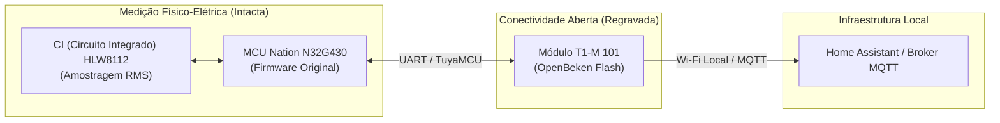

# Passo a Passo de Implementação: Solução A (OpenBeken no SoC Beken BK7238)

Este documento contém o guia prático, passo a passo, para a realização da **Solução A**: regravação de firmware no SoC (System on Chip - Sistema em Chip) Beken **BK7238** (módulo vertical `T1-M 101`) utilizando o firmware aberto **OpenBeken**, mantendo a MCU (Microcontroller Unit - Unidade Microcontroladora) Nation original e integrando o medidor de energia **PJ-1103C** diretamente via **MQTT (Message Queuing Telemetry Transport)** ao **Home Assistant** / broker local, sem nuvem Tuya.

---

## 🧭 Visão Geral da Solução A



### Por que a Solução A é a mais recomendada?
* **Sem modificação destrutiva:** Não é necessário dessoldar a placa filha vertical `T1-M 101` nem cortar trilhas na PCB (Printed Circuit Board - Placa de Circuito Impresso).
* **Preserva a calibração de fábrica:** A MCU (Microcontroller Unit) Nation N32G430 continua operando seu algoritmo original de leitura e calibração de alta precisão com o CI (Circuito Integrado) `HLW8112`.
* **Desvinculação 100% Local:** Elimina totalmente o tráfego com servidores da Tuya na nuvem.
* **Autodescoberta no Home Assistant:** O OpenBeken publica automaticamente as entidades via protocolo padrão de autodescoberta do Home Assistant.

---

## ⚠️ 1. Cuidados Críticos de Segurança de Bancada

> [!CAUTION]
> **PERIGO: FONTE NÃO ISOLADA DA REDE AC (ALTERNATING CURRENT - CORRENTE ALTERNADA)**
>
> 1. **NUNCA conecte o cabo AC (110V/220V) aos bornes `L` e `N`** enquanto a placa estiver ligada ao computador, gravador serial ou programador USB (Universal Serial Bus). O GND (Ground - Terra / Referência Elétrica) da placa é energizado no potencial da rede e causará curto-circuito e choque fatal.
> 2. Durante todo o procedimento de gravação e teste em bancada, alimente a placa **estritamente por uma fonte externa de 3.3V DC (Direct Current - Corrente Contínua) regulada** (ou pela saída 3.3V de um conversor USB-Serial com capacidade de pelo menos 300 mA a 500 mA).

---

## 🛠️ 2. Ferramentas e Materiais Necessários

### Hardware
1. **Conversor USB-Serial (USB-UART):** Chip FTDI, CP2102, CH340G ou PL2303, configurado obrigatoriamente para **nível lógico 3.3V TTL (Transistor-Transistor Logic)** (atenção: nunca usar 5V no pino de dados do Beken).
2. **Fonte de Alimentação 3.3V:** Fonte de bancada regulada ou regulador LDO (Low Dropout Regulator - Regulador de Baixa Queda de Tensão) 3.3V externo.
3. **Conexões:** Jumpers fêmea-fêmea, garras de teste tipo *pogo-pin* ou fios finos (*wrapping wire*) soldados provisoriamente aos pads de teste.
4. **Ferro de solda de ponta fina e fluxo:** Para soldar fios provisórios nos pads traseiros do módulo T1-M (caso não utilize garras de contato).

### Software
1. **Flasher Oficial da Comunidade:** [BK7231 GUI Flash Tool (Easy UART Flasher)](https://github.com/openshwprojects/BK7231GUIFlashTool) *(Recomendado para Windows)* com interface GUI (Graphical User Interface - Interface Gráfica do Usuário).
2. **Firmware OpenBeken:** Binário mais recente da versão **OpenBK7231N** (compatível com a família BK7238):
   * Arquivo: `OpenBK7231N_QIO_*.bin` (baixar na seção de [Releases do OpenBK7231T_App](https://github.com/openshwprojects/OpenBK7231T_App/releases)).
3. **Software de Terminal Serial:** Tera Term, PuTTY ou Serial Studio (para depuração, se necessário).

---

## 📍 3. Pinagem e Ligações Físicas

No verso da placa vertical `T1-M 101`, localize a serigrafia dos pinos:

```text
       +--------------------+
       |     T1-M 101       |
       |  [Blindagem Beken] |
       |                    |
       |  (3V3) (GND) (TX1) |
       |  (RX1) (TX2) (P24) |
       +--------------------+
```

### Tabela de Ligações (Conversor USB-Serial ➔ Módulo T1-M 101)

| Pino do Conversor USB-UART | Pino no Módulo T1-M 101 | Observações |
| :--- | :--- | :--- |
| **GND** | `GND` | Referência elétrica comum (*Ground*). |
| **TXD** (Transmissão de Dados) | `RX1` | Linha de recepção UART do SoC (System on Chip) Beken. |
| **RXD** (Recepção de Dados) | `TX1` (ou `XTX1`) | Linha de transmissão UART do SoC Beken. |
| **3.3V VCC** | `3V3` | Alimentação positiva (+3.3V DC via fonte externa ou USB). |
| *(Opcional)* GND | `P24` | GPIO (General Purpose Input/Output) de modo de boot. |

> 📌 **Dica de Conexão:** Ao ligar RX e TX, lembre-se da regra cruzada: **TX do conversor liga no RX da placa**, e **RX do conversor liga no TX da placa**.

---

## ⚡ 4. Passo a Passo da Gravação de Firmware (Flashing)

### Passo 4.1: Preparar o Software BK7231 GUI Flash Tool
1. Baixe e extraia o `BK7231GUIFlashTool.exe`.
2. Conecte o conversor USB-Serial ao PC e verifique no *Gerenciador de Dispositivos* qual porta COM foi atribuída (ex.: `COM4`).
3. Abra o software e selecione:
   * **Chipset:** `BK7231N` (arquitetura compatível com BK7238).
   * **Serial Port:** A porta COM do seu conversor (ex.: `COM4`).
   * **Baud Rate:** `115200 bps` (ou padrão sugerido pelo flasher).

### Passo 4.2: Fazer Backup da Flash Original (OBRIGATÓRIO)
> [!IMPORTANT]
> **Nunca pule esta etapa.** O backup preserva o endereço MAC (Media Access Control - Endereço Físico de Rede) original de fábrica, os dados de calibração RF (Radio Frequency - Radiofrequência) e permite restaurar o dispositivo caso necessário.

1. No software, clique em **"Do Backup and Flash New"** (ou **"Read Flash / Backup"**).
2. O flasher exibirá uma mensagem aguardando o bootloader (*"Getting bus..."* / *"Waiting for reboot..."*).
3. **Ciclo de Reinicialização (Power Cycle):** Desconecte o pino `3V3` por 1 segundo e reconecte-o.
4. O software detectará a resposta do SoC Beken, iniciará a leitura e salvará um arquivo `.bin` de backup de 2MB no seu computador. Guarde esse arquivo com segurança.

### Passo 4.3: Gravar o OpenBeken
1. Selecione a opção **"Flash OpenBeken"** (ou aponte para o arquivo binário `OpenBK7231N_QIO_x_x_x.bin` baixado).
2. Clique em **"Write"** / **"Flash"**.
3. Se solicitado, faça novamente o ciclo rápido de desliga/liga no pino `3V3`.
4. Aguarde a barra de progresso atingir 100%. Ao término, desconecte os fios de dados do conversor USB.

---

## 📶 5. Configuração Inicial do Wi-Fi no OpenBeken

1. Ligue a placa (com 3.3V DC externo de bancada).
2. No seu smartphone ou computador, procure pelas redes Wi-Fi disponíveis.
3. Conecte-se ao AP (Access Point - Ponto de Acesso) aberto gerado pelo módulo:
   * **SSID (Service Set Identifier - Nome da Rede):** `OpenBK7231N_XXXXXX` (ou similar).
4. Ao conectar, o navegador abrirá automaticamente a página de configuração (caso não abra, acesse no navegador o endereço IP padrão `http://192.168.4.1`).
5. Clique em **"Config"** ➔ **"Configure Wi-Fi"**:
   * Digite o **SSID** e a **Senha** da sua rede Wi-Fi doméstica (2.4 GHz).
   * Clique em **Save**.
6. O dispositivo reiniciará e se conectará ao seu roteador.
7. Acesse o painel do seu roteador para localizar o endereço IP atribuído ao medidor (ex.: `http://192.168.1.150`).

---

## ⚙️ 6. Configuração do Driver TuyaMCU no OpenBeken

Abra a interface Web do OpenBeken pelo navegador (`http://<IP_DO_MEDIDOR>`).

### Passo 6.1: Iniciar os Drivers Necessários
1. Vá em **"Launch Web Application"** (ou **"Config"** ➔ **"Execute Command"**).
2. No campo de comandos (*Command Line*), envie os seguintes comandos para inicializar o subsistema TuyaMCU:

```text
startDriver TuyaMCU
tuyaMcu_setBaudRate 9600
tuyaMcu_defWiFiState 4
```

### Passo 6.2: Mapear os DPs (Datapoints) para os Canais do OpenBeken
Execute os comandos de mapeamento conforme a função de cada grandeza medida:

```text
// Mapeamento dos Datapoints do PJ-1103C:
tuyaMcu_defIdMapping 1 1    // DP 1 -> Canal 1 (Tensão RMS)
tuyaMcu_defIdMapping 2 2    // DP 2 -> Canal 2 (Corrente Canal A)
tuyaMcu_defIdMapping 3 3    // DP 3 -> Canal 3 (Corrente Canal B)
tuyaMcu_defIdMapping 4 4    // DP 4 -> Canal 4 (Potência Ativa)
tuyaMcu_defIdMapping 5 5    // DP 5 -> Canal 5 (Energia Acumulada kWh)
```

### Passo 6.3: Configurar Inicialização Automática (*autoexec.bat*)
Para garantir que os comandos sejam executados sempre que o aparelho ligar:
1. No menu principal, vá em **"Config"** ➔ **"Configure Startup (autoexec.bat)"** (ou **"Filesystem"**).
2. Cole as linhas de inicialização:

```text
startDriver TuyaMCU
tuyaMcu_setBaudRate 9600
tuyaMcu_defWiFiState 4
tuyaMcu_defIdMapping 1 1
tuyaMcu_defIdMapping 2 2
tuyaMcu_defIdMapping 3 3
tuyaMcu_defIdMapping 4 4
tuyaMcu_defIdMapping 5 5
```
3. Clique em **Save**.

---

## 🏠 7. Integração com Home Assistant e Broker MQTT (Message Queuing Telemetry Transport)

### Passo 7.1: Configurar o Broker MQTT no OpenBeken
1. Na interface Web do OpenBeken, acesse **"Config"** ➔ **"Configure MQTT"**.
2. Preencha os dados do seu servidor MQTT (ex.: Mosquitto Broker):
   * **Host:** Endereço IP do Home Assistant ou do Broker (ex.: `192.168.1.100`).
   * **Port:** `1883`.
   * **Client Topic:** `medidor_energia_tuya` (ou nome de sua preferência).
   * **User / Password:** Credenciais de acesso ao broker MQTT.
3. Clique em **Save** e reinicie o dispositivo.

### Passo 7.2: Descoberta Automática no Home Assistant (Home Assistant Discovery)
1. No OpenBeken, vá em **"Config"** ➔ **"Home Assistant Discovery"**.
2. Clique no botão **"Start Home Assistant Discovery"**.
3. Abra o **Home Assistant**, acesse **Configurações ➔ Dispositivos e Serviços ➔ MQTT**.
4. O medidor aparecerá como um novo dispositivo contendo todos os sensores de Tensão RMS, Correntes A/B, Potência e Energia prontos para exibição no Dashboard e no painel de Energia (*Energy Dashboard*).

---

## 🧪 8. Teste em Bancada e Validação de Leituras

Antes de instalar o equipamento de forma definitiva na caixa de disjuntores:
1. Com a placa ainda energizada em 3.3V DC de bancada, conecte o TC (Transformador de Corrente / Clamp A) aos bornes `S1` e `S2`.
2. Passe o clamp por um condutor de teste alimentando uma carga resistiva conhecida (ex.: ferro de passar ou lâmpada incandescente ligada em tomada isolada).
3. Observe no painel do OpenBeken ou no Home Assistant se os valores de corrente e potência respondem instantaneamente ao ligar/desligar a carga.
4. Caso as leituras estejam multiplicadas por 10 ou 1000, ajuste o multiplicador nas opções de canal do OpenBeken ou via template no Home Assistant.

---

## 🏁 9. Conclusão e Instalação Definitiva

Após a validação em bancada:
1. Remova todos os fios provisórios de programação serial (`RX1`, `TX1`).
2. Feche o gabinete plástico do **PJ-1103C**.
3. Encaixe o dispositivo no trilho DIN (Deutsches Institut für Normung - Padrão de Trilho) do quadro de distribuição elétrica.
4. Conecte os bornes `L` e `N` à rede elétrica AC e posicione os TCs (Transformadores de Corrente / Clamps A e B) nos condutores principais.
5. O medidor iniciará imediatamente, conectará à rede Wi-Fi local e transmitirá a telemetria contínua via MQTT sem depender da nuvem Tuya.
