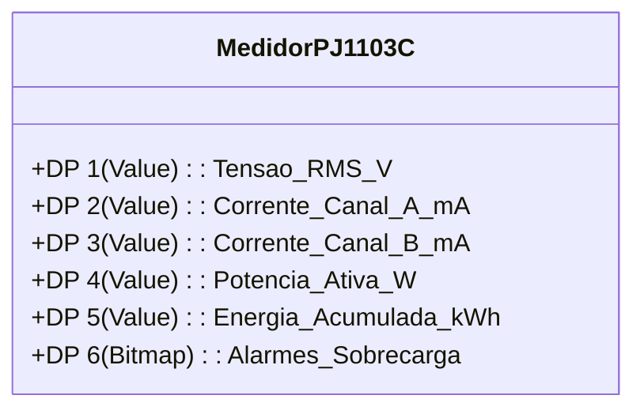
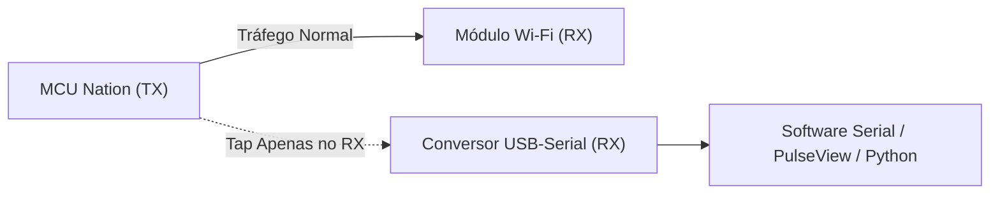

# Guia Técnico Completo: Protocolo TuyaMCU

Este documento detalha o funcionamento, arquitetura, formato de frames, tipos de dados, engenharia reversa e formas de integração do protocolo serial **TuyaMCU**.

---

## 1. O que é o TuyaMCU?

O **TuyaMCU** é o protocolo de comunicação serial assíncrona (UART) padronizado pela Tuya para desacoplar duas funções essenciais em dispositivos inteligentes:

1. **Microcontrolador de Aplicação (MCU Externa):** Responsável pelo controle de hardware em tempo real, leitura analógica de sensores de precisão (ex.: chip `HLW8112`), acionamento de relés e lógica de segurança local.
2. **Módulo de Rádio/Conectividade:** Responsável pela pilha de rede (Wi-Fi, BLE, Zigbee), provisionamento, criptografia de transporte e comunicação com a nuvem ou servidor local.

```mermaid
flowchart LR
    subgraph "Camada Local / Sensores"
        Sensor["TC Clamps / Tensão AC"] --> HLW["CI HLW8112"]
        HLW --> MCU["MCU Principal\n(ex.: Nation N32G430)"]
    end

    subgraph "Camada de Conectividade"
        MCU <-->|UART / TuyaMCU (Hex)| Radio["Módulo de Rádio\n(ex.: Beken BK7238 / ESP32)"]
    end

    subgraph "Camada de Rede"
        Radio <-->|Wi-Fi / MQTT / HTTP| Server["Home Assistant / Broker MQTT / Nuvem"]
    end
```

---

## 2. Abertura e Licenciamento

* **Camada Serial Livre e Não Criptografada:** Ao contrário do tráfego de rede TLS com a nuvem, os dados transmitidos pelo barramento UART entre os dois chips **não possuem criptografia**. Trafegam em hexadecimal estruturado (*plaintext bytes*).
* **Documentação Pública:** A Tuya mantém documentação técnica oficial aberta sobre os comandos e fluxos do protocolo para desenvolvedores de hardware.
* **Ecossistema Open-Source:** Amplamente suportado e documentado em projetos abertos como **ESPHome**, **Tasmota**, **OpenBeken** e **Home Assistant**.

---

## 3. Especificação e Anatomia do Pacote (Frame Format)

Cada mensagem trocada pela UART obedece à seguinte sequência rígida de bytes:

```text
+--------+--------+---------+---------+-------------+---------------------+----------+
| Header | Header | Versão  | Comando | Comprimento | Payload (Datapoint) | Checksum |
| (0x55) | (0xAA) | (1 B)   | (1 B)   | (2 Bytes)   | (N Bytes)           | (1 Byte) |
+--------+--------+---------+---------+-------------+---------------------+----------+
```

### Detalhamento dos Campos

| Campo | Tamanho | Descrição | Exemplo |
| :--- | :---: | :--- | :--- |
| **Header** | 2 bytes | Bytes fixos de sincronismo de início de frame | `0x55 0xAA` |
| **Versão** | 1 byte | Versão do protocolo de comunicação | `0x00` ou `0x03` |
| **Comando** | 1 byte | Código da ação executada pelo pacote | `0x00` (Heartbeat), `0x06` (Reportar DP) |
| **Comprimento** | 2 bytes | Quantidade total de bytes do payload (Big-Endian) | `0x00 0x08` (8 bytes de payload) |
| **Payload** | N bytes | Contém um ou mais Datapoints estruturados | `[DP ID][Tipo][Tamanho][Valor]` |
| **Checksum** | 1 byte | Soma de verificação de todos os bytes (exceto header) `mod 256` | `0x7E` |

---

## 4. Tabela de Principais Comandos (`Command ID`)

| Hex | Nome do Comando | Direção | Finalidade |
| :---: | :--- | :---: | :--- |
| `0x00` | **Heartbeat** | Módulo ➔ MCU | Pulso periódico de verificação de liveness / integridade da conexão. |
| `0x01` | **Product Information** | Módulo ➔ MCU | Solicita PID do produto, versão de firmware e configurações. |
| `0x02` | **Working Mode** | Módulo ➔ MCU | Consulta modo de operação da MCU. |
| `0x03` | **Wi-Fi State** | Módulo ➔ MCU | Notifica a MCU sobre status da rede (conectado, desconectado, modo AP). |
| `0x04` | **Reset Wi-Fi** | MCU ➔ Módulo | Solicita reinicialização do rádio ou entrada em modo de emparelhamento. |
| `0x06` | **Send / Report DP** | Ambos | Envio de comandos de controle ou relatório síncrono de status. |
| `0x07` | **Report DP Status (Async)**| MCU ➔ Módulo | Envio espontâneo de leituras de sensores e variações de grandezas elétricas. |

---

## 5. Estrutura dos Datapoints (DPs)

O *Payload* das mensagens `0x06` e `0x07` é composto por blocos de Datapoint:

```text
[DP ID] (1 Byte) + [Tipo] (1 Byte) + [Tamanho] (2 Bytes) + [Valor] (N Bytes)
```

### Tipos de Dados Suportados

| Código (`Type`) | Tipo | Formato | Aplicação Típica |
| :---: | :--- | :--- | :--- |
| `0x00` | **Raw** | Array de bytes livres | Pacotes proprietários, curvas de calibração |
| `0x01` | **Boolean** | 1 byte (`0x00` = Off / `0x01` = On) | Relé ligado/desligado, alarmes |
| `0x02` | **Value** | Inteiro de 4 bytes sem sinal (Big-Endian) | **Tensão, Corrente, Potência, Energia** |
| `0x03` | **String** | String ASCII / UTF-8 | Textos descritivos, versões, IDs |
| `0x04` | **Enum** | 1 byte numérico (0, 1, 2...) | Modos de operação selecionáveis |
| `0x05` | **Bitmap** | 1, 2 ou 4 bytes (máscara de bits) | Códigos de erro múltiplos e flags de falha |

> 💡 **Fator de Escala:** Os valores do tipo `Value` (`0x02`) trafegam como inteiros multiplicados por fatores de escala:
> * Tensão (`127.4 V`) ➔ enviado como `1274` (multiplicador 10) ou `12740` (multiplicador 100).
> * Corrente (`12.35 A`) ➔ enviado como `12350` (multiplicador 1000 / mA).
> * Potência (`1560.2 W`) ➔ enviado como `15602` (multiplicador 10).

---

## 6. Mapeamento Típico em Medidores de Energia (PJ-1103C)



---

## 7. Como Acessar e Interceptar os Dados na Prática

### 7.1. Interceptação Passiva com Analisador Lógico / USB-Serial



* **Cuidados Elétricos:** Alimentar o medidor com **3.3V externo de bancada** e manter a rede AC 110V/220V **totalmente desconectada**.
* **Parâmetros Seriais:**
  * Baud Rate: **9600 bps** (ou **115200 bps** em alguns modelos)
  * Data bits: **8**
  * Parity: **None**
  * Stop bits: **1** (`8N1`)

### 7.2. Script Python de Exemplo para Decodificação Passiva

```python
import serial

def parse_tuya_frame(data: bytes):
    if len(data) < 7:
        return
    if data[0] != 0x55 or data[1] != 0xAA:
        return
    
    version = data[2]
    cmd = data[3]
    length = (data[4] << 8) | data[5]
    payload = data[6:6 + length]
    checksum = data[6 + length] if len(data) > 6 + length else None
    
    print(f"[TuyaMCU] Cmd: 0x{cmd:02X} | Length: {length} | Payload: {payload.hex()} | Checksum: {checksum}")
    
    # Decodificar Datapoint se for comando de relatório (0x06 ou 0x07)
    if cmd in (0x06, 0x07) and len(payload) >= 4:
        dp_id = payload[0]
        dp_type = payload[1]
        dp_len = (payload[2] << 8) | payload[3]
        dp_val = payload[4:4 + dp_len]
        print(f"  └─ DP ID: {dp_id} | Tipo: {dp_type} | Valor Hex: {dp_val.hex()} | Valor Int: {int.from_bytes(dp_val, 'big')}")

# Exemplo de leitura contínua da porta COM
if __name__ == "__main__":
    # ser = serial.Serial("COM3", 9600, timeout=1)
    sample_frame = bytes.fromhex("55AA0006000801020004000004FA4E")
    parse_tuya_frame(sample_frame)
```

---

## 8. Integração em Firmwares Alternativos

### 8.1. OpenBeken (No SoC Beken BK7238 nativo)
Configuração no console web:
```text
tuyaMcu_setBaudRate 9600
tuyaMcu_defWiFiState 4
tuyaMcu_defIdMapping 1 1    // Mapeia DP 1 para Canal 1 (Tensão)
tuyaMcu_defIdMapping 2 2    // Mapeia DP 2 para Canal 2 (Corrente)
tuyaMcu_defIdMapping 3 3    // Mapeia DP 3 para Canal 3 (Potência)
```

### 8.2. ESPHome (Substituição por ESP32 / ESP8266)
```yaml
uart:
  id: uart_bus
  tx_pin: GPIO1
  rx_pin: GPIO3
  baud_rate: 9600

tuya:
  uart_id: uart_bus

sensor:
  - platform: tuya
    name: "Tensão da Rede"
    sensor_datapoint: 1
    unit_of_measurement: "V"
    accuracy_decimals: 1
    filters:
      - multiply: 0.1

  - platform: tuya
    name: "Corrente Canal A"
    sensor_datapoint: 2
    unit_of_measurement: "A"
    accuracy_decimals: 2
    filters:
      - multiply: 0.001

  - platform: tuya
    name: "Potência Ativa Canal A"
    sensor_datapoint: 3
    unit_of_measurement: "W"
    accuracy_decimals: 1
    filters:
      - multiply: 0.1
```

---

## 9. Links e Referências Oficiais

* 📘 [Tuya IoT Platform - MCU Universal Serial Port Protocol](https://developer.tuya.com/en/docs/iot/tuya-cloud-universal-serial-port-access-protocol)
* 📗 [Tuya Developer - MCU Development Overview](https://developer.tuya.com/en/docs/iot/mcu-development-overview)
* 📙 [ESPHome Tuya Component Documentation](https://esphome.io/components/tuya.html)
* 📕 [Tasmota TuyaMCU Reference Guide](https://tasmota.github.io/docs/TuyaMCU/)
